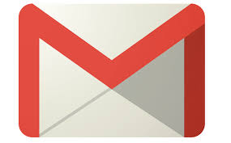
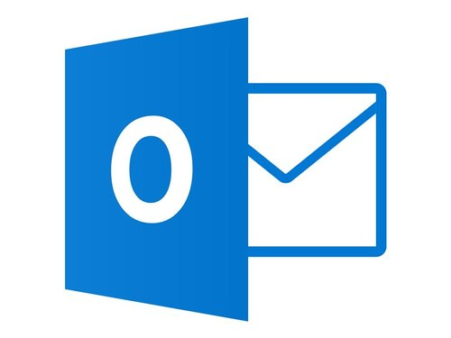
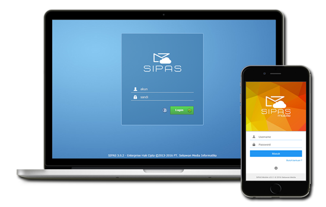

# Praktikum Teknologi Cloud Computing Minggu-02
# Latihan no. 2 dan Tugas

<h2>Dua Layanan SaaS</h2>
1. Gmail 
2. Microsoft Outlook

Kedua layanan cloud ini memiliki fungsionalitas yang sama, yang keduanya
dapat melakukan proses mengirim dan menerima surat elektronik dan masih mempunyai beberapa
fitur pendukung lainya.

<dd> <b>1. Gmail</b> 

 

Gmail adalah layanan surel milik Google. Pengguna dapat mengakses Gmail dalam bentuk surat web HTTPS,
protokol POP3 atau IMAP4.Gmail diluncurkan dengan sistem undangan dalam bentuk Beta pada 1 April 2004
dan tersedia untuk publik pada 7 Februari 2007 meski masih menyandang status Beta.
Bersama seluruh produk Google Apps, layanan ini tidak lagi Beta pada 7 Juli 2009.
 
<b>1. Fitur Gmail</b>
1. Gmail menyediakan ruang penyimpanan dengan kapasitas yang sangat besar, lebih dari 7538 Megabyte dan terus bertambah. 
2. Gmail mengaplikasikan teknologi pencarian dari Google, hal ini memberi kemudahan bagi  pengguna Gmail untuk mencari suatu file tertentu dari e mail mereka. 
Gmail juga iklan yang didasarkan dari e mail yang diterima oleh pengguna. 
Tapi iklan itu hanya diperlihatkan kepada pengguna Gmail dan tidak dikirimkan ke alamat eksternal. 
3. Gmail dapat mengirimkan Attachment (lampiran)hingga 20 Megabyte per e mail. 
4. Salah satu hal baru yang ditawarkan oleh Gmail adalah pemilihan e mail dalam bentuk "Conversation View". 
Dengan begitu e mail yang diterima akan diurutkan dalam bentuk percakapan, sehingga semua balasan dan topik tidak terpisah-pisah. 
Hal ini bisa membuat pengguna lebih mudah melihat e mail yang mereka dapat. 
 

<b>2. Microsoft Outlook</b> 

 

Microsoft Outlook atau Microsoft Office Outlook adalah sebuah program personal information manager dari Microsoft, dan bagian dari suite Microsoft Office. 
Walaupun biasanya hanya digunakan untuk mengirim dan membaca surat-e, program ini juga memiliki fungsi kalender, jadwal kerja, catatan, dan jurnal. 
Bila digunakan bersama dengan Microsoft Exchange Server, Outlook dapat menyediakan akses kotak surat, kalender, dan jadwal bersama. 

<b>1. Fitur Microsoft Outlook</b> 
1. Sebagai Surel/Email 
Fungsi awal yang biasanya identik dengan Outlook adalah perannya sebagai surat elektronik. 
Outlook sendiri memang merupakan pengganti dari Hotmail yang diakusisi Microsoft pada tahun 1997.
Outlook juga melengkapi aplikasi e-mailnya dengan berbagai fitur lain yang membuatnya jauh lebih sempurna.
Menu format yang dimiliki Outlook memugkinkan EVers mengedit email, seperti membuat cetak tebal, miring, dan garis bawah. 
Ada juga dropdown box yang memungkinkan kamu untuk melakukan edit yang lebih mendalam lagi, mulai dari mengubah font, ukuran, warna, hingga highlight. 
bahkan bisa mencoret atau membuat subscript dan superscript. Di luar itu, masih banyak lagi kemampuan mengedit yang bisa ditemukan di Outlook.
dan juga bisa menandai e-mail penting, prioritas. 
2. Agenda dan Kalender 
Salah satu fitur wajib MO adalah fungsinya sebagai kalender dan agenda. 
Untuk mempermudah kinerja dan sinkronisasi semua fungsi �Outlook� bisa mengatur setiap jadwal menggunakan salah satu fungsinya sebagai kalender dan agenda. 
Fitur yang menjadi satu dengan �Outlook� ini memungkinkan untuk mengatur berbagai jadwal meeting ataupun menyusun deadline pekerjaan atau tugas.
Bahkan bisa melakukan sinkronisasi jika memiliki aplikasi manajemen kalender bawaan di gadget penggunanya.
3. Pengaturan Kontak dan File 
Berbagai macam manajemen seperti kontak, file seperti tugas, dan catatan juga menjadi fitur yang harus ada dalam sebuah aplikasi.
Aplikasi bisa menyimpan kontak dan terhubung dengan berbagai layanan penyimpanan, seperti penyimpanan OneDrive dan layanan 
pihak ketiga yang populer seperti Dropbox. Bisa membuat sebuah kontak atau file dan mengaksesnya dari berbagai perangkat.
4. Mengatur berbagai akun 
Outlook dapat membantu mengatur dan mempermudah manajemen akun yang penggunaanya miliki.
Berbagai akun populer seperti Office 365, Exchange, Yahoo, dan Google juga didukung oleh Outlook. 
5. Interface 
Tampilan surel dari Outlook sangat bersih dan jelas. Tidak ada desain yang terlalu ramai sehingga bisa fokus pada konten email. 

<h2>Layanan versi non-Cloud </h2> 
<b>1. Sipas</b> 

 

Sipas merupakan aplikasi dekstop yang memiliki fungsionalitas yang sama seperti dua layanan cloud diatas.
Memiliki fitur antara lain : 
1. Surat Masuk 
Pencatatan Surat Masuk dari instansi lain dilengkapi atribut surat, upload dokumen dan tujuan penerima. 
2. Surat Keluar 
Pencatatan Surat Keluar yang ditujukan ke instansi lain beserta dengan atribut surat dan upload dokumen. 
3. Surat Internal 
Kebutuhan pendistribusian Surat Resmi dilingkungan internal kantor langsung dari aplikasi SIPAS. 
4. Disposisi 
Pendistribusian Surat dan pemberian tindakan Surat ke akun penerima langsung dari aplikasi SIPAS 
5. Konsep Surat 
Rancangan atau Surat Keluar dapat dibuat langsung dari Aplikasi SIPAS.
6. Penomoran Otomatis 
Pemberian nomor Surat Keluar dan nomor agenda Surat Masuk dengan pengaturan format yang flexible. 
7. Ekspedisi 
Rincian alur pendistribusian Surat dan riwayat perjalan Surat di internal kantor. 
8. Korespondensi Surat 
Penyesuaian relasi keterkaitan antara Surat Masuk dan Surat Keluar. 
9. Asistensi Monitoring 
Sekretaris dapat dengan mudah memantau Surat Masuk maupun Disposisi pimpinan.

</dd>