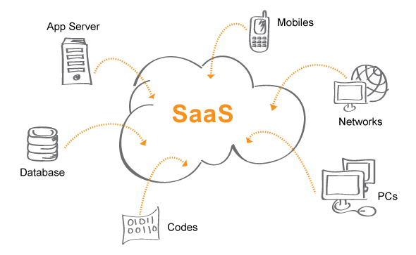
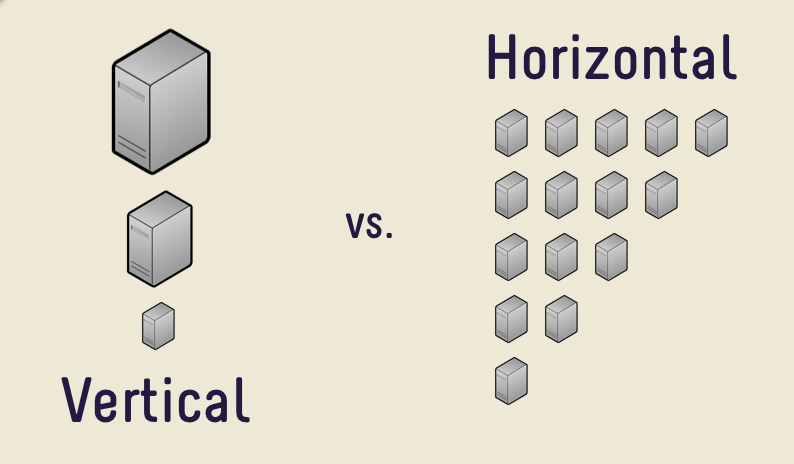
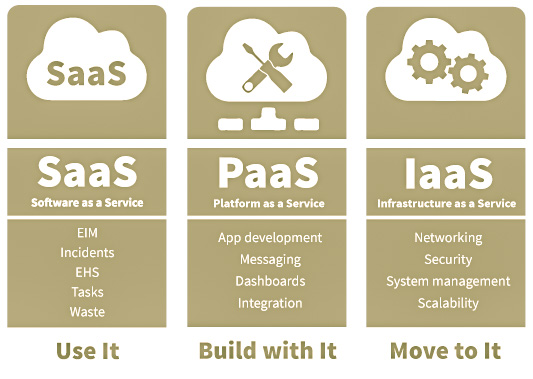
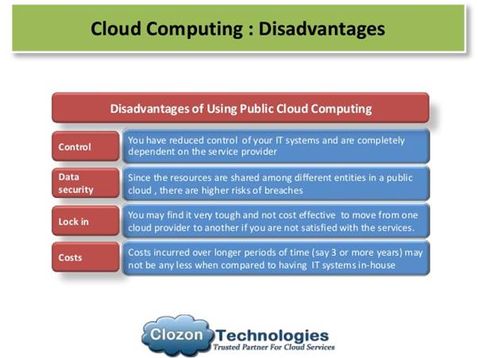
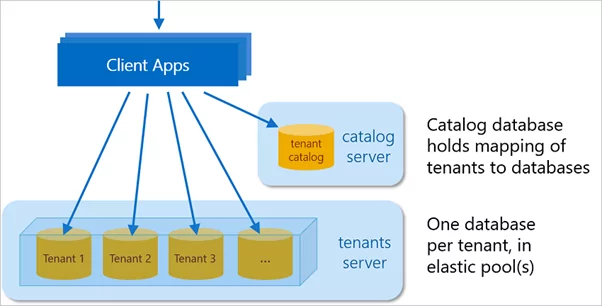

<h2>1. Apa itu SaaS (Software as a Service)</h2>
<dd>Proses menjalankan aplikasi di cloud yang disediakan layanan publik. Pengguna dapat menggunakan aplikasi ini melalui media layanan Internet. Aplikasi ini dikelola oleh Penyedia Layanan. Penyedia Layanannya sendiri seperti SalesForce, Microsoft (Office 365), Oracle, Google (Google Apps), dll. 
SaaS adalah model layanan umum untuk banyak aplikasi bisnis, termasuk aplikasi perkantoran dan pesan, aplikasi manajemen, virtualisasi dll. 
<h4>Skema/ Architecture SaaS </h4>

</dd>
<h2>2. Arsitektur Saas</h2>
<dd>Dengan model atau asitektur ini, satu aplikasi dapat digunakan untuk semua pelanggan. Aplikasi ini diinstal pada banyak mesin untuk mendukung skalabilitas pengguna layanannya. 
Ada dua model utama SaaS: 

1. SaaS Vertikal 
        
Perangkat Lunak untuk kebutuhan industri  tertentu seperti (Perangkat lunak untuk kesehatan, pertanian, real estat, industri keuangan)

2. SaaS Horisontal 
        
Produk-produk yang berfokus pada kategori perangkat lunak seperti(pemasaran, penjualan, alat pengembang, SDM) tetapi agnostik industri.

<b>Mengapa menggunakan achitecture SaaS?</b> 
Seperti yang dijelaskan sebelumnya, perangkat lunak telah didistribusikan kepada pelanggan dalam berbagai saluran. Saluran distribusi yang lebih baru dalam Perangkat Lunak sebagai Layanan (atau SaaS).

</dd>
<h2>3. Keuntungan SaaS</h2>
<dd>

 1. Integrasi dapat direncanakan dan dilaksanakan dengan upaya minimal. 
 2. menciptakan waktu sesingkat mungkin untuk proses kerja IT(pengembang sistem/developer).  
 3. memungkinkan sejumlah penyedia layanan SaaS untuk menawarkan percobaan bagi pengguna secara gratis dari perangkat lunak mereka untuk periode terbatas,seperti 30 hari. 
 4. Memberi pelanggan kesempatan untuk mencoba perangkat lunak sebelum mereka membelinya dan membantu menghilangkan banyak risiko seputar pembelian perangkat lunak.</dd>

<h2>3. Kerugian dari Platform SaaS</h2>

<dd>

 

<b>

1. Lack of control</b> 
Karena aplikasi SaaS berada di-host server web vendor, Pengguna memiliki sedikit atau tidak ada kontrol atas perangkat lunak yang digunakan. Developers aplikasi akan memberikan pengguna kontrol/penggunaam lebih besar, misalnya, aplikasi berbasis Windows mungkin memiliki lebih banyak opsi konfigurasi daripada aplikasi web biasa yang dikirim sebagai aplikasi SaaS. 
<b>

2. Limited ecosystem</b> 
Masih banyak aplikasi yang tidak menawarkan versi yang diinginkan. 
<b>

3. Performance</b> 
Aplikasi internal, klien sever, atau lokal akan selalu berjalan lebih cepat dari pada proses yang dikirim melalui internet(proses lambat). 
<b>

4. Data Concerns</b> 
Saat memilih produk SaaS, misalnya, dengan munculnya GDPR, bisnis harus memberikan perhatian khusus dalam hal di mana implementasi SaaS menyimpan data di cloud. Setiap tempat memiliki kebijakan penyimpanan sendiri dan dilakukan ketika data sensitif diproses atau disimpan.
</dd>

<h2>4. Jenis- jenis Layanan SaaS</h2>
<dd>Beberapa jenis layanan yang dapat dikembangkan sebagai aplikasi perangkat lunak yang dapat mencakup dan tidak terbatas, antara lain : 

1. Office applications 
2. Email and instant messaging 
3. Social media 
4. Exposing 3rd Party APIs 
5. Security and authentication 
6. Machine Learning 
7. Artificial intelligence 
8. Location Services 
9. Data streaming and lookup services
</dd>
<h2>5. Komponen Penting dari Platform SaaS</h2>
<dd>

 
Komponen utamanya antara lain : 

<b>

1. Security</b> 
Melindungi data pelanggan di platform SaaS adalah yang paling penting, karena itu, produk layanan SaaS terhadap penggunanya kemungkinan besar akan melayani keamanan ratusan hingga ribuan penggunanya.  
<b>

2. Privacy</b> 
Privasi data adalah komponen penting lainnya yang harus dipertimbangkan layanan platform SaaS. Dengan peraturan baru, seperti GDPR, memastikan privasi pengguna dan data tetap terjaga dan dengan temuan dari KPMG menyatakan bahwa Privasi Data adalah atribut terpenting kedua yang mereka cari dalam penyedia cloud, privasi merupakan komponen penting untuk pertimbangkan saat membuat produk SaaS pengguna sendiri. 
<b>

3. Customisation and Configuration</b> 
Perusahaan sering mengharapkan kustomisasi tambahan untuk menangani kasus penggunaan khusus untuk domain masalah mereka. Perpanjang untuk arsitektur SaaS pengguna adalah komponen penting lainnya untuk dipertimbangkan. Pengguna dapat melakukan ini dengan mengirimkan versi dari produk SaaS pengguna atau dengan menerapkan mekanisme plugin yang memungkinkan bisnis dan atau pengembang untuk memperluas solusi SaaS pengguna. 
</dd>
<h2>6. Pertimbangan Desain untuk Platform SaaS</h2>
<dd>

 
<b>

1. Scalability</b> 
Dengan menggunakan perangkat keras seperti Network Load Balancers untuk mendistribusikan lalu lintas masuk secara merata di beberapa server web. Dari perspektif arsitektur perangkat lunak, memiliki lapisan individual untuk menangani akses data, logika bisnis, dan lapisan presentasi aplikasi.
<b>

2. Zero downtime and Service Level Agreements</b> 
Dapat memberikan keteentuan layanan dan danpat menjamin ketika aplikasi atau layananan pengguna mendapat sebuah masalah. 
<b>

3. Multi-tenancy</b> 
Agar perangkat lunak pengguna dikirimkan sebagai produk SaaS, itu harus mendukung multi-tenancy. Produk harus dapat mengakomodasi banyak pengguna sementara pada saat yang sama, memastikan bahwa data pengguna, privasi dan semuanya masih diperhatikan. Luangkan waktu untuk memasukkan faktor ini ke dalam desain arsitektur SaaS Anda dan memastikan bahwa apa pun yang Anda terapkan, memiliki model yang dapat diskalakan.
</dd>
<h2>7. Cara membangun aplikasi SaaS berbasis cloud</h2>
<dd>
<b>

1. Bagaimana cara memulai?</b> 
Memastikan bahasa pemrograman mana yang ingin digunakan, basis datanya, perangkat lunak yang mau digunakan. 
<b>

2. Bahasa pemrograman mana yang mau digunakan?</b> 
Menentukan bahasa pemrograman yang bisa digunakan. Ada berbagai bahasa pemrograman (modern) utuk bisa digunakan. Seperti Python, dll. 
<b>

3. Basis data</b> 
Basis data yang paling banyak digunakan untuk kaitanyya dengan SaaS ialah <b>document-oriented database</b>. 
Mengapa? 

1. Database dokumen mendapatkan informasi tipe dari data itu sendiri. Dengan demikian setiap instance data dapat berbeda dari yang lain.

2. Ini memungkinkan lebih banyak fleksibilitas, terutama ketika berhadapan dengan perubahan. Dan sering mengurangi ukuran basis data.

Singkatnya, konsep DOB lebil fleksibel dengan teknik pemrograman modern. 
Jenis- jenisnya antara lain : 
1. MongoDB 
Karena MongoDB adalah database berorientasi dokumen yang memberikan kinerja tinggi, ketersediaan tinggi, dan skalabilitas lebih mudah.
</dd>

 